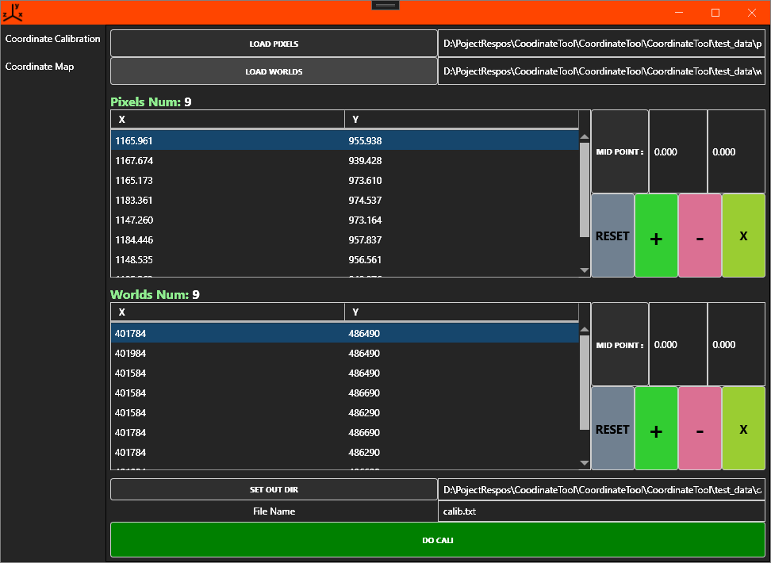
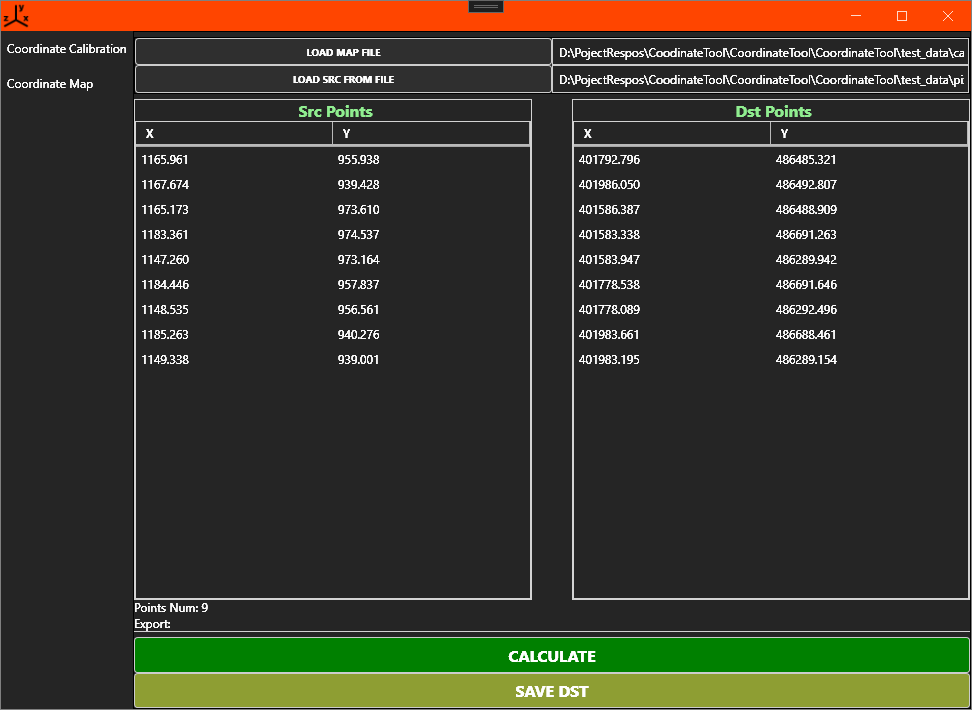

# CoordinateTool
a tool of calibration for c1 to c2 . (2d) , and transform c1 to c2 . (2d)

#  for doNet project set no prefix output dir:
edit the .csproj file  :
insert  to  ``<PropertyGroup>``
```
	 <AppendTargetFrameworkToOutputPath>output</AppendTargetFrameworkToOutputPath>
	 <OutputPath>$(SolutionDir)\bin</OutputPath>
```

## How to use

1. Calibrate
   * test_data:
   * load pixels  -> test_data/pixels.txt
   * load worlds  -> test_data/worlds.txt
   * Caculate the transformation matrix  -> test_data/calib.txt
  
  
2. Transform
   * load calib.txt
   * load pixels  -> test_data/pixels.txt
   * Transform the pixels , compare with raw worlds
  

### Reference
reference: https://github.com/jinneigeyu/CoordinateTool

### License
MIT License

Copyright (c) 2024 JinYu Kim

Permission is hereby granted, free of charge, to any person obtaining a copy
of this software and associated documentation files (the "Software"), to deal
in the Software without restriction, including without limitation the rights
to use, copy, modify, merge, publish, distribute, sublicense, and/or sell
copies of the Software, and to permit persons to whom the Software is
furnished to do so, subject to the following conditions:

1. The above copyright notice and this permission notice shall be included in
   all copies or substantial portions of the Software.

2. THE SOFTWARE IS PROVIDED "AS IS", WITHOUT WARRANTY OF ANY KIND, EXPRESS OR
   IMPLIED, INCLUDING BUT NOT LIMITED TO THE WARRANTIES OF MERCHANTABILITY,
   FITNESS FOR A PARTICULAR PURPOSE AND NONINFRINGEMENT. IN NO EVENT SHALL THE
   AUTHORS OR COPYRIGHT HOLDERS BE LIABLE FOR ANY CLAIM, DAMAGES OR OTHER
   LIABILITY, WHETHER IN AN ACTION OF CONTRACT, TORT OR OTHERWISE, ARISING FROM,
   OUT OF OR IN CONNECTION WITH THE SOFTWARE OR THE USE OR OTHER DEALINGS IN
   THE SOFTWARE.
